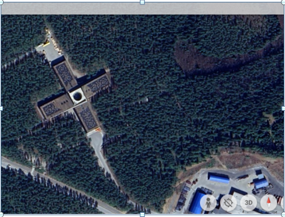

# Preject serre en TSTI2D2
## Besoin initial :
Afin d'améliorer la production et la rentabilité des cultures, la maîtrise de différents paramètres climatiques est indispensable. Il est notamment important de maintenir une température juste suffisante, ainsi que de contrôler et minimiser l'arrosage des différentes plantes.

## Objectif de l'amelioration :
Réduire la consommation d'eau en maximisant l'arrosage (contrôle quantitatif) et réduire les coûts en énergie électrique par le contrôle de la température notamment en hivers.
# Les taches a resoudre :
- Mettre en place un système d'ouverture du panneau mobile et réaliser toutes les fixations pour les éléments liés à l’irrigation
  (pompe, panneaux solaires,système de traitement de données).
- Commander l’ouverture ainsi que le chauffagede la mini serre, et l’arrosage des plantations.
- Assurer l'autonomie en énergie sur site isolé.
